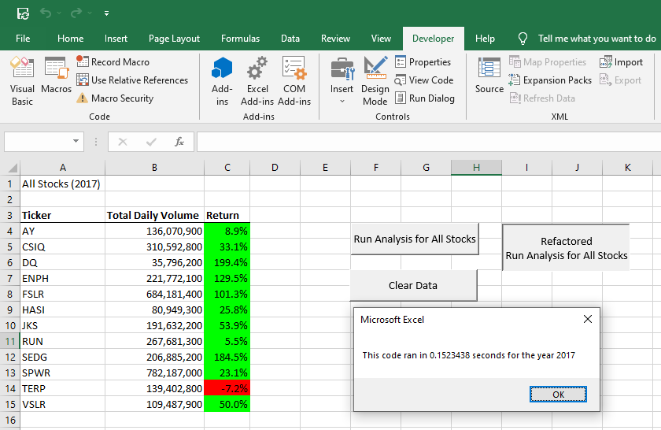

# stock-analysis
Analysis of Green Energy Stocks

## Overview of Project

### The purpose of this project was to refactor the initial VBA code on green_stocks.xlsm file to make it more efficeient.  This should also allow the file to be edited and debugged easier in the future.

## Analysis and Challenges

### Analysis of VBA green_stocks.xlsm

As shown in the images above, the first version of the VBA code ran in over 0.9 seconds.

### Analysis of VBA VBA_Challenge.xlsm

As shown in the images above, the refactored version of the VBA code ran in under 0.16 seconds. This is an improvement of 0.74 seconds over the previous VBA code.

### Advantages and Disadvantages

The advantages for refactoring the VBA code for All Stocks Analysis worksheet were many.  The previous code was written between 6 different macros.  Once the VBA code was refactored the only macros needed for the updated file were AllStocksAnalysisRefactored, DQAnalysis, and yearClearWorksheet.  The code is now easier to read and maintain for any future revisions needed.

The disadvantges for refractoring VBA code is the time it can consume for other projects.  It might be more time efficient to rewrite the code from scratch. 

## Results

- What are two conclusions you can draw about the Outcomes based on Launch Date?

- What can you conclude about the Outcomes based on Goals?

- What are some limitations of this dataset?

- What are some other possible tables and/or graphs that we could create?
